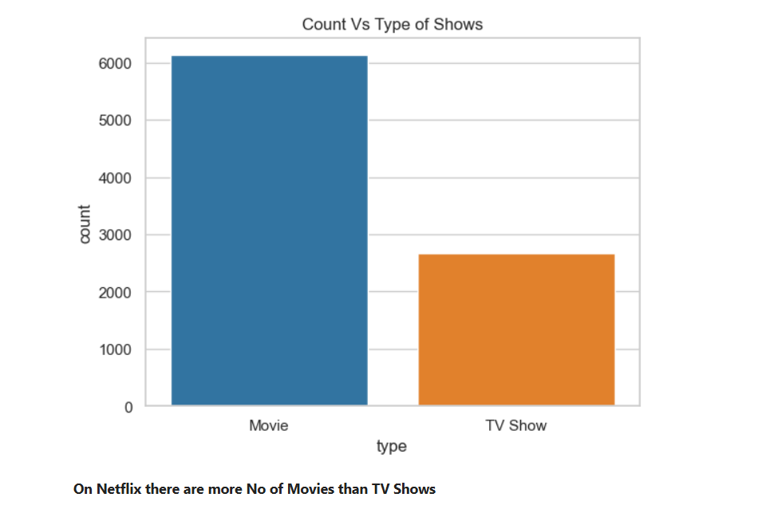
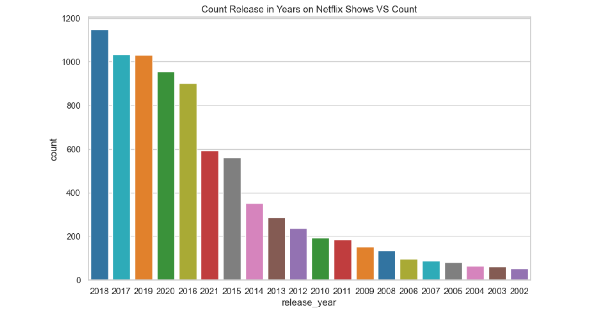
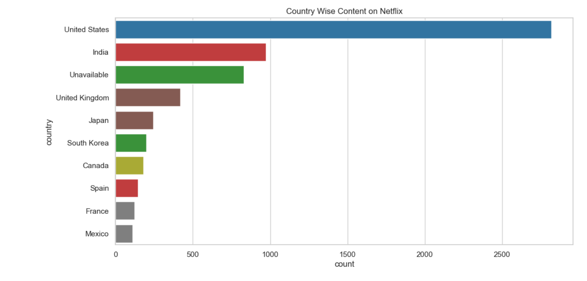
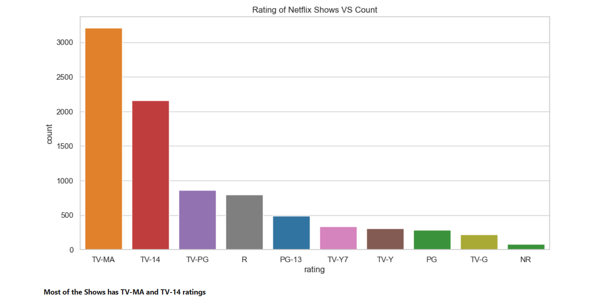

#  Netflix Movies and TV Shows Analysis

##  Project Description

This project presents an in-depth Exploratory Data Analysis (EDA) of the Netflix Movies and TV Shows dataset, leveraging powerful Python libraries such as Pandas, NumPy, Matplotlib, and Seaborn. The primary objective is to derive meaningful insights and uncover hidden patterns within the dataset by performing thorough data cleaning, preprocessing, and visualization.

Through this analysis, we examine key aspects of Netflix's content library, including the distribution between Movies and TV Shows, temporal trends in content release over the years, variations in content production across different countries, and runtime/duration patterns. By visually representing these patterns, the project aims to highlight content preferences, geographic production diversity, and how Netflix's offerings have evolved over time.

This EDA serves as a foundational step in understanding the structure of entertainment datasets and can be extended to drive further applications like recommendation systems, trend forecasting, or content strategy analysis. The project is a great demonstration of how data science can be applied to real-world entertainment industry data to extract actionable insights.

---

##  Dataset
**Source:** [Kaggle - Netflix Dataset](https://www.kaggle.com/datasets/shivamb/netflix-shows)

The dataset contains over 10,000+ titles with features like:
- `title`
- `director`
- `cast`
- `country`
- `release_year`
- `duration`
- and more.

---

##  Technologies Used
- Python  
- Pandas, NumPy  
- Matplotlib, Seaborn  
- Jupyter Notebook  

---

##  Key Insights & Visualizations

This project visualizes key trends and patterns in Netflix content. The analysis includes:

- Distribution of Movies vs TV Shows  
- Content release trend over the years  
- Country-wise content production  
- Duration distribution across content types  
- Ratings of Netflix content  
- Annual content release count  
- Top genres on Netflix  

###  Visualizations are stored in the `screenshots/` folder.

### 🔹 Sample Visuals

  
*Distribution of content type on Netflix*

  
*Annual content release trend*

  
*Top countries by number of titles*

  
*Count of content by maturity rating*

---

##  How to Run

```bash
# Clone the repository
git clone https://github.com/AbdullahShariq/Netflix-EDA.git

# Navigate to the project directory
cd Netflix-EDA

# Launch the Jupyter Notebook
jupyter notebook "Netflix Movies and TV Shows Analysis.ipynb"
```
---
## Summary of Insights

- **Movies dominate Netflix’s catalog**, indicating a stronger emphasis on cinematic content compared to TV Shows.  
- The **United States leads as the top content producer**, followed by India, showcasing their major contributions to Netflix's global library.  
- A significant portion of Netflix’s content is **targeted toward mature audiences**, reflecting the platform's focus on adult-oriented programming.  
- **2018 marked the peak year for content releases**, suggesting a major expansion phase for Netflix during that period.  
- **“International Movies” and “Dramas”** are among the most popular genres, emphasizing the platform’s global appeal and the audience's preference for narrative-rich storytelling.
-Overall, this EDA **sheds light on Netflix’s global content dynamics** and sets the stage for **more advanced analytics and insights**.


